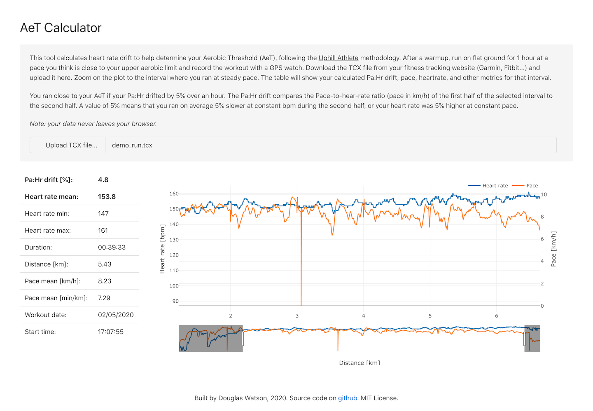

# AeT calculator

- Douglas Watson, May 2020
- MIT License

This is a browser-based tool to calculate heart rate drift during an activity recorded on a GPS watch with heart rate. This metric is to determine your Aerobic Threshold, as defined by Uphill Athlete: https://www.uphillathlete.com/heart-rate-drift/.

## How to use it?

Open the [live page](https://douglas-watson.github.io/aet-calc/index.html) and follow the instructions. You can load a TCX file by drag-and-drop or with the file picker.



## Developers

To extend this project, check it out and install npm dependencies:

```
git clone https://github.com/douglas-watson/aet-calc.git
npm install
```

To run a web server with live-reload, live-bundling etc.:

```
npm run watch
```

And to build for distribution:

```
npm run build
```

The resulting index.html and bundle.js files (the only two files) are created in the `dist/` folder. These can be hosted by a static file server.

### Structure

The code is a bit ridiculous, as I used this project as an exercise in building a JS app with no framework, i.e. re-inventing the wheel. The components are bundled with `browserify`, using `reload` for quicker development. I store the

- `index.html`: obviously defines the layout and text, and also embeds a Mustache template for the summary table. It uses the Bulma css framework for styling.
- `main.js`: handles templating, file loading (drag and drop, file input), and mostly initializes each component.
- `data.js`: handles data processing: parsing the TCX file, calculating summary data
- `store.js`: stores the state of the application, notifies subscribers of changes.
- `plot.js`: wraps Plotly plot - defines layout, config, and data transformation to match plotly's preferred format.
